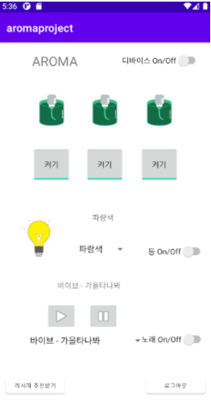
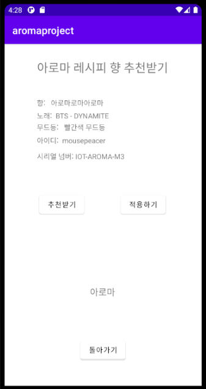
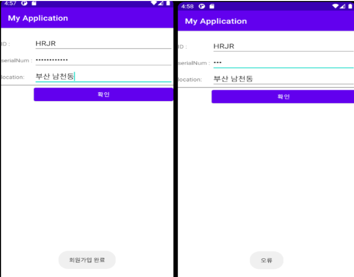

# 📱 AROMA Android App

[상세 코드 보기 [Docs]](https://drive.google.com/file/d/16xxYELVgsO8QSeTsyH_2ys3BdXWiv0Zs/view?usp=sharing)

- IOT 자동 조향 프로젝트에서 사용자가 디퓨저를 컨트롤하는 안드로이드 앱 프로젝트 입니다. (DB설계, 서버 작업, 데이터 크롤링은 아래 문서 참고)

## Spec

- Android - Framework
- Java - Language
- Socket - Rysberri Pi Connect
- Okhttp3 - Server Connect
- Sharedpreferences - Module Data Save, Share Data to other Activity

# <자세한 기능 설명>

## 1. 메인 화면

  

- 메인 UI에서는 원하는 디퓨저의 상태를 설정 할 수 있습니다.

## 2. 레시피 추천 화면

  

- 레시피 추천 받기 화면에서 추천받기 클릭시 레시피가 나오고, 적용하기 클릭시 디퓨저에 즉시 적용이 됩니다.

## 3. 회원가입(기기 등록) 화면

  

- 회원가입(기기 등록) 시 입력 SerialNum의 값이 서버DB의 값과 맞는지 비교 후, 회원가입 와료 또는 오류

## 시연 영상

<iframe width="560" height="315" src="https://www.youtube.com/watch?v=6XIpaUdc13I" frameborder="0" allowfullscreen></iframe>

